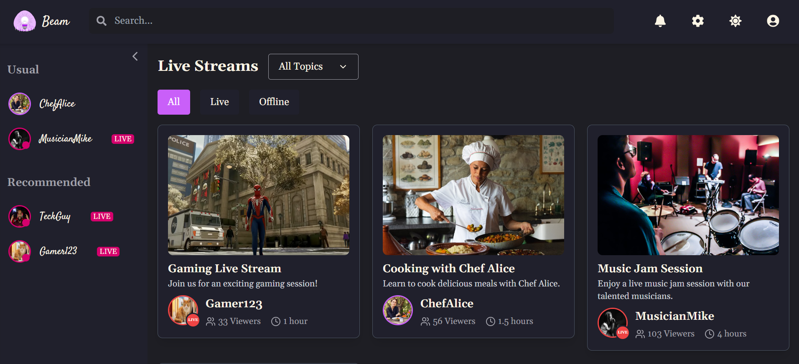
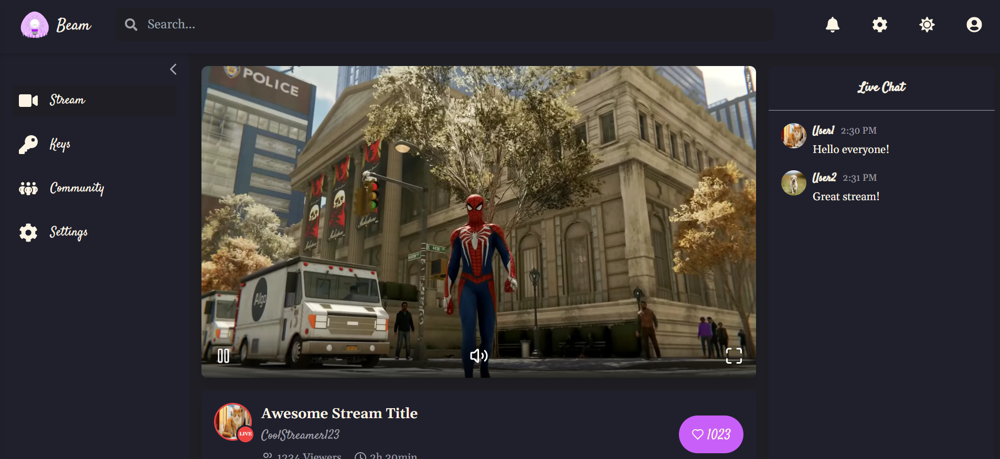
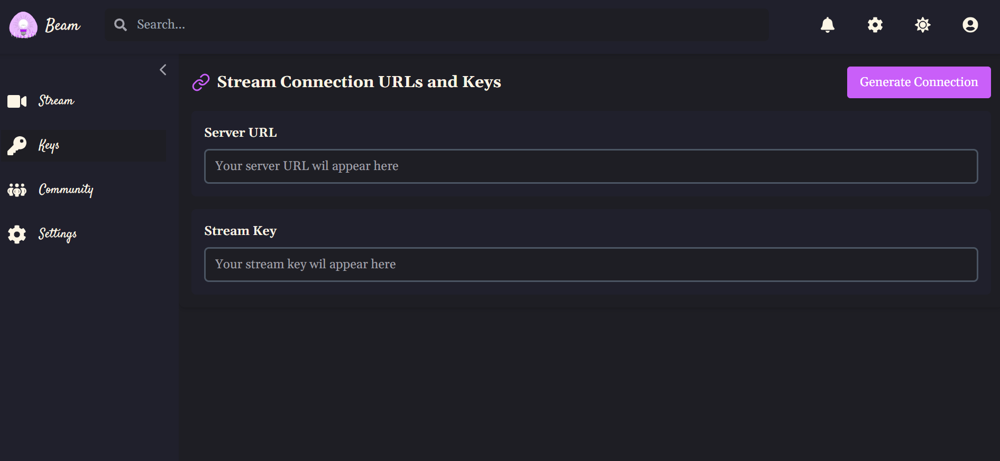
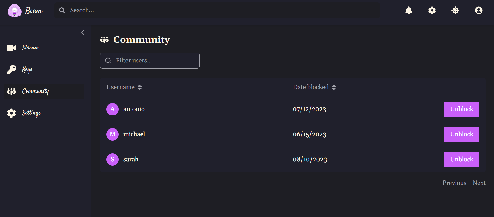
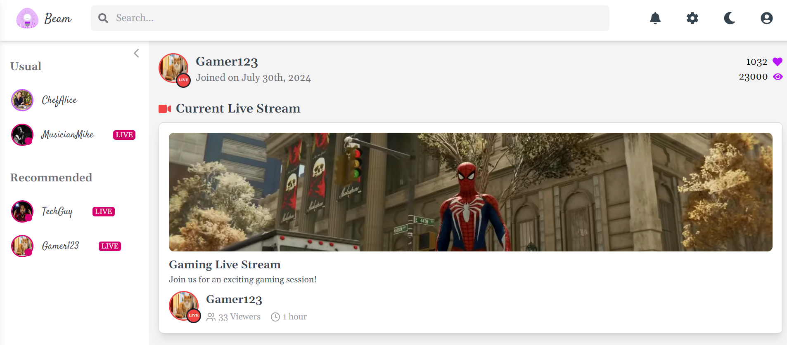
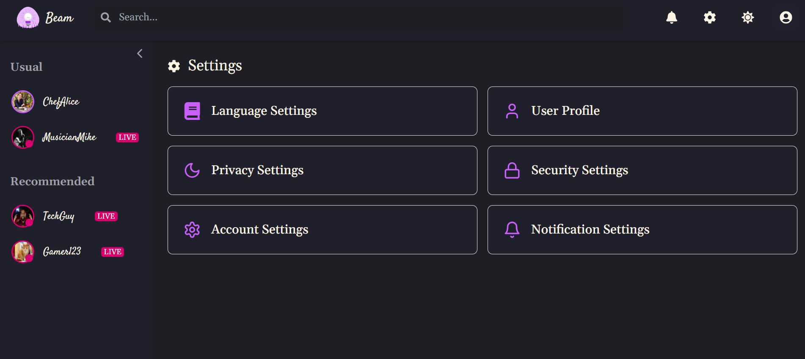
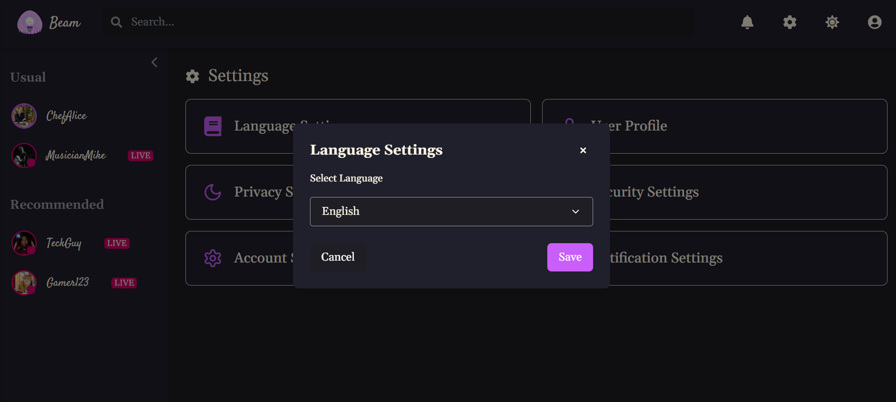
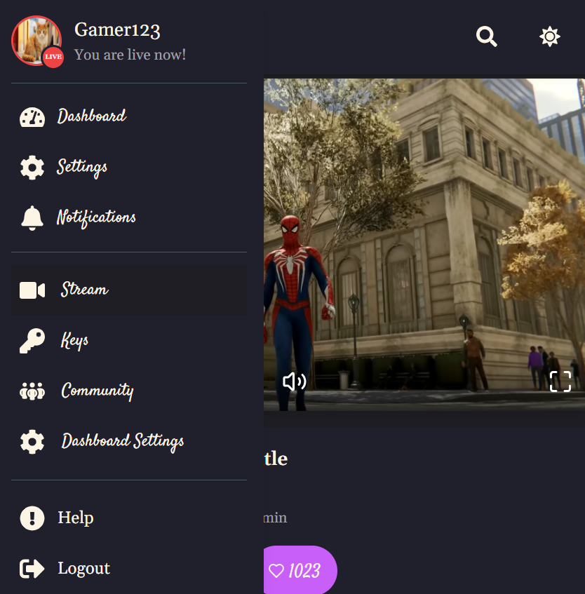
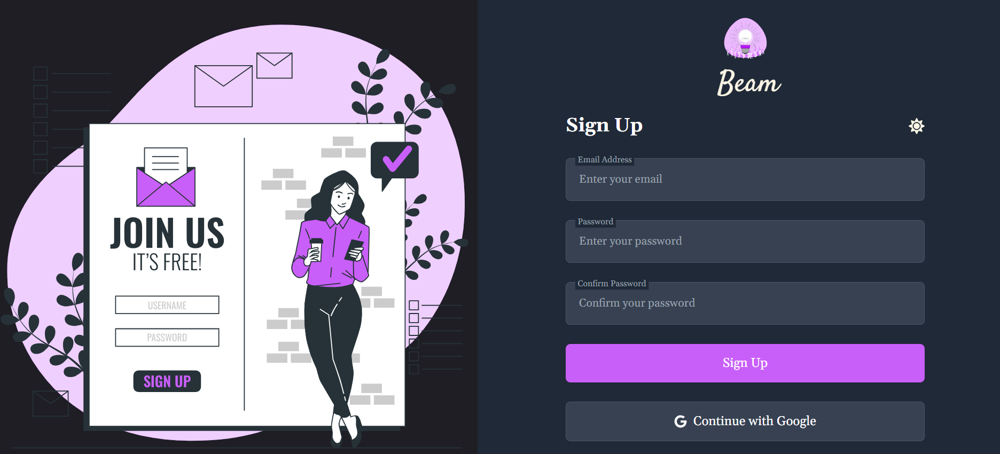
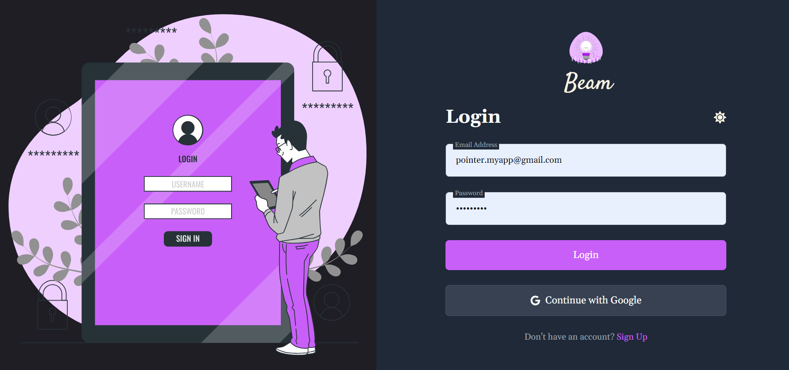

# Beam (Ongoing)

## Overview
Beam is a fully responsive live streaming platform that leverages modern technologies to provide a seamless experience for both streamers and viewers. 

### Key Features
- Live streaming functionality powered by **LiveKit**
- Real-time chat integration using **Pusher**
- Data persistence managed through **PostgreSQL**
- User-friendly interface designed with **Tailwind CSS**

## Tech Stack
- **Frontend**: Next.js, TypeScript, React.js, Redux, NextAuth, Tailwind CSS
- **Backend**: Prisma, PostgreSQL, Neon
- **Real-time Communication**: Pusher, LiveKit
- **Others**: Bcript, Gemini, REST APIs
- **Deployment**: Vercel

## Screenshots
| Screen | Description |
|--------|-------------|
|  | Users can navigate the current streams, search for streamers, and see followed and recommended ones. |
|  | Users can access the creator's dashboard for managing live streams. |
|  | Streamers can generate live stream keys utilizing LiveKit Ingress. |
|  | Streamers can manage their community, block or unblock users. |
|  | Users can manage their profiles and visit other users' profiles. All views support dark and light themes based on user preference. |
|  | Users can manage their account settings. |
|  | Users can change the language and more. |
|  | A custom mobile sidebar for a responsive design. |
|  | Users can create a custom account that is inserted into the Neon PostgreSQL database using a Prisma schema. |
|  | Users can log in via a custom account or using Google OAuth. Authentication is handled via NextAuth, providing a session used across all pages to verify user authentication. |

## Conclusion
This project is still in progress, and further updates will be provided as development continues.

## Links
- **Demo**: Coming soon...
